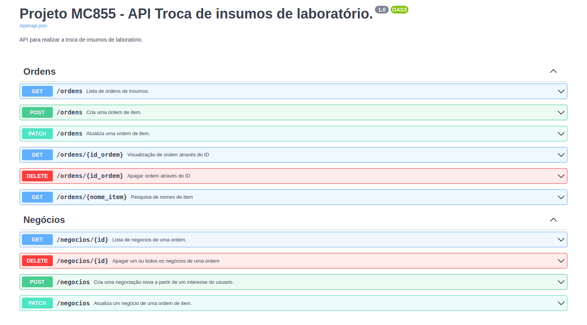
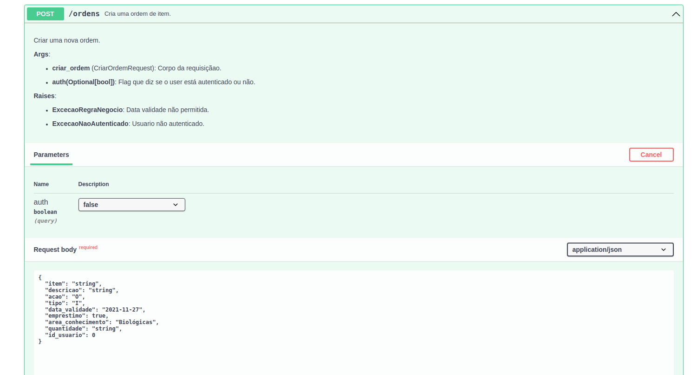
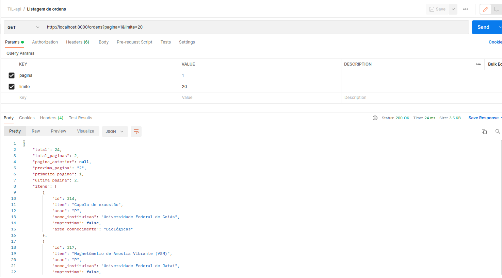
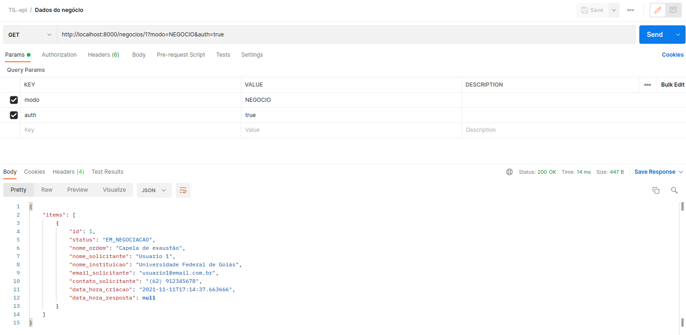

# Universidade Estadual de Campinas
# Instituto da Computação

## Disciplina: MC855-2s2021

## TIL-Troca de Insumos de Laboratórios (API)

#### Professor e Assistente

| Nome                     | Email                        |
| ------------------------ | ---------------------------- |
| Professora Juliana Borin | jufborin [at] unicamp.br     |
| Assistente Paulo Kussler | paulo.kussler [at] gmail.com |


#### Equipe

| Nome                        | RA     | Email                       | User Git         |
| --------------------------- | ------ | --------------------------- | ---------------- |
| Filipe Cavalheiro Marques   | 148524 | f148524 [at] dac.unicamp.br | @filipemarques33 |
| João Victor Flores da Costa | 199818 | j199818 [at] dac.unicamp.br | @JoaoFloresDev   |
| Leandro Nascimento          | 171855 | l171855 [at] dac.unicamp.br | @leandrones      |
| Leonardo Yukio Koike        | 201332 | l201332 [at] dac.unicamp.br | @leokoike        |
| Lucas Silva Lopes do Carmo  | 202110 | l202110 [at] dac.unicamp.br | @Locke23         |

### Descrição do projeto:

API da Troca de Insumos de Laboratórios (TIL), um projeto da matéria mc855.
Prova de conceito para melhorias da plataforma ["Solidariedade à Pesquisa"](https://solidariedade.unicamp.br/home/), iniciativa da
Faculdade de Ciências Médicas (FCM) da Unicamp.


#### Tela do projeto API
Abaixo estão imagens do projeto rodando:
- A tela com todos os endpoints criados:

- Exemplo de uma requisição:


#### Repositório da Professora Juliana no Gitlab do IC ou Zip com o projeto e todos artefatos para futuras evoluções dos projetos por outros alunos das turmas seguintes


## Developers API
Leandro Nascimento RA: 171855\
Leonardo Koike RA: 201332

## Dependência do projeto
make\
python (versão 3.8 de preferência)\
pip

## Principais bibliotecas utilizadas no projeto:
[fastapi](https://fastapi.tiangolo.com/)\
[sqlalchemy](https://www.sqlalchemy.org/)\
[alembic](https://alembic.sqlalchemy.org/)

## Instalação das bibliotecas
No diretório root desse projeto, basta executar os seguintes comandos:

- Criação e ativação da ambiente virtual
```python
python -m venv mc855 & source mc855/bin/activate
```
- Instalar o gerenciador de pacotes poetry
```python
pip install poetry
```
- Instalar as bibliotecas utilizadas no projeto
```python
poetry install
```

## Banco de dados
Para obter um banco de dados de teste:
- faça o download do [database.db](https://drive.google.com/file/d/1vWXiHYSWDb6ZSaRwMMj3mNioY59UbNXF/view?usp=sharing) para a pasta root do projeto.

Para criar um novo banco de dados:
- Execute o seguinte comando no diretório root do projeto:
```shell
cd app/ & alembic upgrade head
```
Esse comando irá criar um banco de dados novo na pasta root do projeto, caso não exista um banco de dados lá.

## Execução
No seu prompt de comando ou terminal, basta executar os seguintes comandos:

```shell
make run
```

Para envio das requests:
- Acessar no browser o host: [http://localhost:8000/docs](http://localhost:8000/docs)
- Com uma plataforma de API, criar suas requisições para url http://localhost:8000/


## Plataforma de API
Recomendamos utilizar o [Postman](https://www.postman.com/). Com isso é possível construir suas requests e verificar as respostas dos endpoints.\
A seguir temos alguns exemplos:
- Request para listagem de ordens

- Request para saber os dados do negócio



## Testes
Ainda não foram implementados testes automatizados.

## Criar e executar as migrations
Para fazer alterações no banco de dados (adicionar novas tabelas e colunas), é preciso seguir os seguintes passos:
- Criar uma migration executando o seguinte comando:
```shell
cd app/
alembic revision --autogenerate -m 'adiciona_coluna_x_na_tabela_y'
```

- Com a migração criada, basta executar o seguinte comando para executá-la:
```shell
cd app/
alembic upgrade head
```

## Próximos passos
Acreditamos que os próximos passos desse projeto esteja em:
- Colocar a aplicação e o banco de dados em um ambiente da nuvem
- Desenvolver um Dockerfile
- Trocar o modelo de banco de dados para um Postgres
- Desenvolver um sistema de autenticação ou integrar ao serviço de autenticação do utilizado pelo Solidariedade.
- 